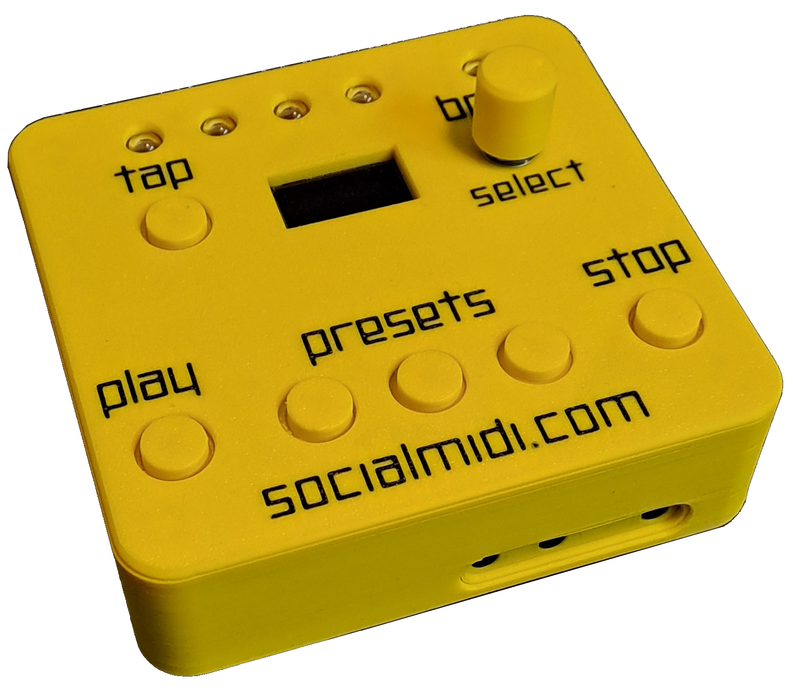
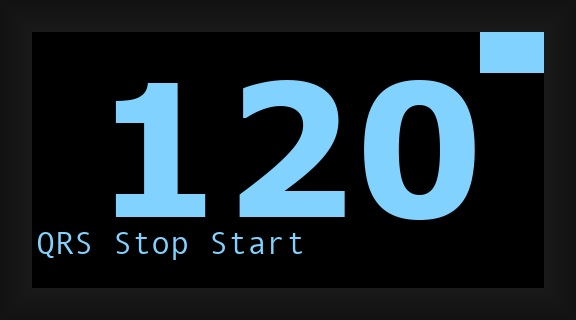
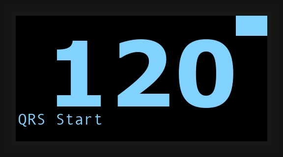
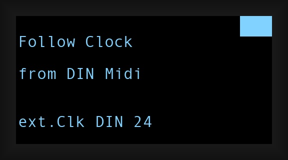
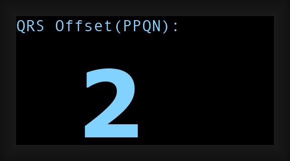
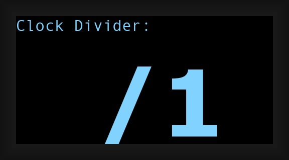
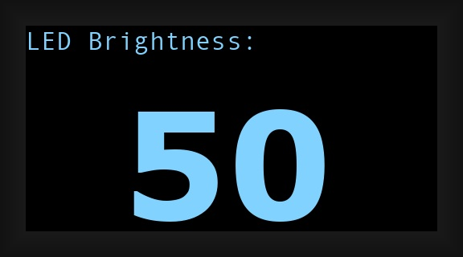
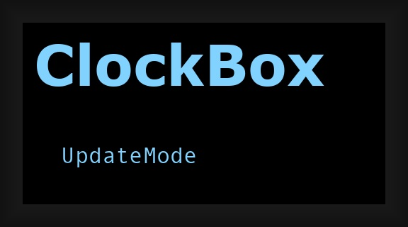

# ClockBox v3 Manual

## Intro
Welcome to the wonderful world of tempo-syncing devices via MIDI. If you came here you probably tried to sync your DAW with a drum computer, a synthesizer, or something else and realized that this topic DOES have its quirks. MIDI clock synchronization can be tricky, and timing issues, jitter, or drifting devices are commonly known problems.

We have encountered virtually every single one of these issues ourselves. That experience led us to develop the **ClockBox v3**—a dedicated hardware solution designed to make MIDI clock synchronization stable, predictable, and stress-free.

With ClockBox v3, syncing is no longer a problem.

[https://socialmidi.com](https://socialmidi.com/)

## Features
- 6 MIDI outputs (TRS, Type A)
- 1 MIDI input (TRS, Type A)
- 1 MIDI IN / OUT via USB
- CV/Gate sync output
- 3 tempo presets with optional smooth fade
- Quantized Restart (QRS)
- 4 clock modes (2 standalone / 2 follow-mode)
- Open source

---

## Hardware

### Top panel

**Controls:**

| Label | Function |
|---|---|
| TAP | Tap tempo |
| PLAY (START) | Start / Quantized Restart |
| STOP | Stop |
| PRESET 1 / 2 / 3 | Recall or save BPM presets |
| ENCODER | Adjust BPM / navigate settings |
| Display | Shows BPM and mode info |
| LEDs (×5) | Beat and status indicators |

### Front panel
The front panel provides three I/O connections: **CV Start**, **CV Clock**, and **MIDI IN** (TRS). CV outputs carry 5V logic-level; MIDI IN accepts standard TRS MIDI (Type A).  

### Rear panel
The rear panel exposes six independent **MIDI OUT** ports (TRS) and a **USB** port for MIDI communication and firmware updates. All MIDI OUT ports transmit the same clock signal simultaneously.  

### Bottom panel
The bottom panel carries a labelled silkscreen identifying all I/O connections.  

---

## Basic Usage

The ClockBox v3 can run standalone or connected to a computer. Apply power via USB and you are good to go. When powered on, the currently installed firmware version is being displayed for 2 seconds.

By default the device is set to **QRS Stop Start** mode — the go-to mode for most setups. Connect your MIDI devices and press PLAY. Everything will be in sync.

### Set the Tempo

- **TAP button** — tap repeatedly (4+ taps) to set BPM by feel
- **Encoder (turn)** — adjust BPM ±1 per click
- **Encoder (hold + turn)** — adjust BPM ±5 per click
- **Preset buttons (short press)** — instantly jump to a saved BPM value
- **Preset buttons (long press, ≥1 second)** — smoothly fade to the saved BPM value

### Save a Tempo Preset

Hold the **encoder button** and click **PRESET 1**, **2**, or **3**. The LEDs flash red to confirm the new value has been saved.

Three preset slots are available. Each stores a single BPM value.

### QRS: Quantized Restart

**Just hit PLAY while the clock is running to re-sync everything.**

Over time, individual devices can drift out of sync even when connected to the same clock source. Quantized Restart (QRS) fixes this without stopping the music. When you press PLAY while the clock is running, the LEDs change colour to indicate QRS is armed. With the next downbeat (beat #1), all connected devices receive an optional MIDI Stop and a Start signal and automatically snap back to the correct position (See **QRS Stop Start** and **QRS Start** under **Advanced usage**).

---

## LED Indicators

| Colour | Meaning |
|---|---|
| Cyan (all) | Power-on initialization |
| Green (LED 1-4) | Beat 1 of the current measure (playing) |
| Blue (LEDs 2–4) | Beats 2, 3, 4 of the measure (playing) |
| Purple / Magenta | Quantized Restart queued — waiting for next downbeat |
| Yellow (LED 5) | incoming MIDI Clock (Follow Clock from DIN MIDI and Follow Clock from USB MIDI) |
| Red (all) | Saving to memory, or Firmware Update Mode |
| Off | Clock stopped |

---

## Display

| Display content | When shown |
|---|---|
| Large BPM number | Standalone modes (A or B) |
| "QRS Start" (bottom bar) | Standalone mode, Quantized Restart only sends MIDI Start |
| "QRS Stop Start" (bottom bar) | Standalone mode, Quantized Restart only sends MIDI Stop AND Start  |
| "Follow Clock from DIN Midi" | Follow DIN mode |
| "Follow Clock from USB Midi" | Follow USB mode |
| Beat blink indicator (top-right) | Every quarter note pulse |
| "QRS Offset (PPQN): N" | While editing QRS Offset |
| "Clock Divider: /N" | While editing Clock Divider |

---

## Advanced Usage

### Modes

The ClockBox v3 has four modes that determine how it generates or reacts to a clock signal. The active mode is shown at the bottom of the display and is saved automatically.

#### QRS Stop Start *(default)*

  
The ClockBox acts as the master clock. When Quantized Restart is triggered (PLAY while running), it sends **MIDI Stop** slightly before the downbeat, then **MIDI Start** exactly on beat 1. This mode covers probably ~90% of all setups.

#### QRS Start

The ClockBox acts as the master clock. Quantized Restart only sends a **MIDI Start** on the next downbeat — no Stop message.

#### Follow Clock from DIN MIDI

The ClockBox receives a 24 PPQN MIDI clock signal on the **MIDI IN** (TRS, Type A) jack and forwards it to all outputs (6 TRS MIDI OUT + USB). BPM is not displayed in this mode to keep the clock pass-through as tight as possible. The internal clock generator is bypassed. 

#### Follow Clock from USB MIDI

Same as above, but the clock source is **USB MIDI** instead of TRS. Incoming clock data are forwarded to the TRS MIDI outputs.

Both follow modes also for Qunatized Restart to be triggered. 

### Changing the Mode

**Hold ENCODER + press PLAY (START)** → cycles to the next mode:

> QRS Stop Start → QRS Start → Follow DIN → Follow USB → ...

The new mode appears on the display and is saved immediately.

### QRS Offset Fine-Tuning

In QRS Stop Start mode, you can adjust the timing gap between the MIDI Stop and MIDI Start messages.

**Enter:** Hold **ENCODER + press STOP**
**Adjust:** Turn encoder (range: 1–24 PPQN ticks)
**Save & exit:** Release both buttons — LEDs flash red to confirm

- **Value 1**: Stop is sent very close to beat 1 (tightest)
- **Value 24**: Stop is sent 24 PPQGN ticks (beat 4) ahead of the next downbeat
- **Recommended: 2** — tested sweet spot with Ableton and most hardware

The value is saved to internal memory and recalled upon startup.

---

## CV/Gate Sync Output

The front-panel CV/Gate jack outputs a tempo pulse that can trigger Eurorack sequencers, drum machines, and other modular gear.

- Signal is only active **while the clock is playing**
- Pulse rate is determined by the **Clock Divider** setting

### Clock Divider

Divides the CV/Gate output rate relative to the master clock.

**Enter:** Hold **ENCODER + press TAP**
**Adjust:** Turn encoder
**Save & exit:** Release both buttons — LEDs flash red to confirm

Available divisions: **/1, /2, /4, /8, /16, /32, /64**
Default: /1 (one pulse per 24th note; i.e., the raw 24 PPQN rate)

---

### LED Brightness

Adjusts the brightness of the five LEDs.

**Enter:** Hold **PLAY (START) + STOP** while the deviceis powered on. (encoder button must not be held)
**Adjust:** Turn encoder (±10 per click), range: 10–200
**Save & exit:** Release both buttons — LEDs flash red to confirm

The value is saved to internal memory and recalled upon startup.

---

## Firmware Update

### When to Update

Visit this link to check if updates are available: [https://github.com/Andymann/clockbox-v3/blob/main/changelog.md](https://github.com/Andymann/clockbox-v3/blob/main/changelog.md).  
  
Two options for a frimware update exist:

- **Build from source** — compile the `.ino` file from the GitHub repository. Make sure to use the libraries that are provided with this repository.
- **Flash a prebuilt firmware** — use the one-line script below

The script downloads all required binaries, locates the ClockBox, and flashes the firmware. The device resets automatically when complete.

### Entering Update Mode

1. Power off the ClockBox.
2. Hold the **STOP** button.
3. Connect the ClockBox v3 to your computer.
4. Release the button.
5. The 4 top LEDs turn **red** and the display shows "UpdateMode".

The device is now ready to receive a new firmware upload. MIDI output is silenced during this mode.

### Flashing a Prebuilt Firmware

Open a terminal and run the command for your target firmware version.

**macOS — Firmware v3.48**

    curl -L https://raw.githubusercontent.com/Andymann/clockbox_v3/refs/heads/main/scripts/upload_clockboxv3-3.48_MAC.sh | bash

**Win11 — t.b.d.**

After uploading, power-cycle the device normally.

---

## MIDI Clock Behaviour

In Standalone modes, MIDI clock ticks (byte `0xF8`) are sent **continuously** — even when the transport is stopped. This allows for connected hard- and software to adapt to incoming clock. 
Clock is sent simultaneously on:
- All TRS MIDI outputs (hardware serial, 31250 baud)
- USB MIDI

In Follow modes, clock bytes are passed through immediately with no buffering to keep jitter as low as possible.

---

## Saved Settings (EEPROM)

All settings persist through power cycles.

| Setting | Default |
|---|---|
| Preset 1 BPM | 80 |
| Preset 2 BPM | 100 |
| Preset 3 BPM | 120 |
| Clock Mode | QRS Stop Start |
| QRS Offset | 1 |
| Clock Divider | /1 |
| LED Brightness | 50 |

---

## Declaration of conformity

It is hereby confirmed, that the ClockBox v3 meets all rules
and regulations regarding EU-directive 2004/108/EG for
electromagnetic compliance to protect humans and the
environment.  
 
 
 
 

ClockBox v3 is compliant with the RoHS directive.
 
 
 
 

If you wish to dispose your ClockBox v3, please contact your
local dealer for recycling. Do not put it in your household
waste.  
 
 
 
 

## Open soure
Find sourcecode, diagrams, etc at [https://github.com/Andymann/clockbox-v3](https://github.com/Andymann/clockbox-v3)
## Document versions
| version | changes |
|---|---|
| 0.5 | auto-generated stub |
| 0.6 | fix typos, add details |
| 0.7 | add LED brightness settings |
| 0.8 | add display renderings |
| 0.9 | add declaration of conformity |
| 1.0 | finetune views and descriptions |
| 1.1 | remove reset-procedure |
| 1.2 | add instructions for firmware update |

---
